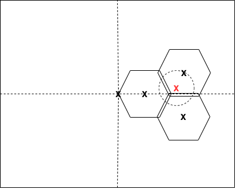
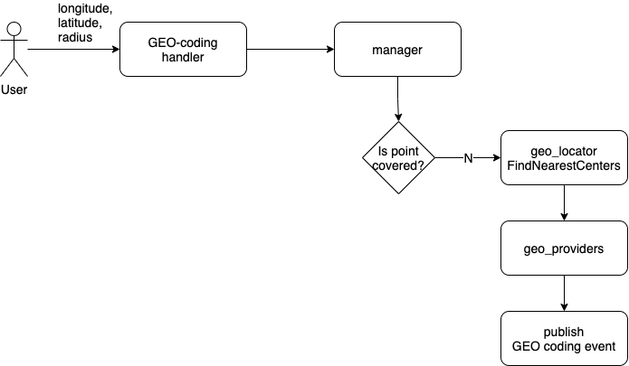

# 8. GEO location persistence solution.

Date: 2021-03-23

## Status

In progress

## Context

Proposal to build GEO information persistence layer.

### Design

The world map will be represented in 2D Cartesian coordinates system:
* Latitude: X axis
* Longitude: Y axis

The origin of the coordinate system will be Greenwich prime meridian.
The world map will sequentially spit by hexagons with fixed radius 100 meters.

Hexagons should have small overlaps (up to 0.5 meter) to avoid PostGIS GEO coordinates rounding issue.
GEO coordinates should be rounded up to 6 decimals.

GEO locator component will be responsible for search the nearest hexagon centers for specific point.

PostGIS plugin will be used to store all GEO related information in the DB.

### How to migrate existing data

1. Copy required tables with data
2. Perform migration via PL/pgSQL procedure
3. Swap origin and copy tables

### Migration steps

1. Prepare new build 
2. Delete K8S deployment
3. Backup DB
4. Run migration procedure
5. Deploy new build

### GEO locator function

* `func FindNearestCenters(point geo.Point) []geo.Point`

### GEO polygon repository methods

* `IsPointCovered` returns `true` if the point fully covered by one or more polygons, otherwise `false`.

* `GetPointCoveredPlaces` returns all places which are covered by a specific point polygon.

* `GetPolygonPlaces` returns all places which belong to the specific polygon.

* `AddPolygonPlace` bind place to the specific polygon (do nothing if binding exists).

* `AddPolygon` persists GEO polygon with center in a specific point.

* `GetPolygon` return GEO polygon entity with center in a specific point.

* `GetPolygonPlace` returns a specific place that belongs to the specific polygon.
