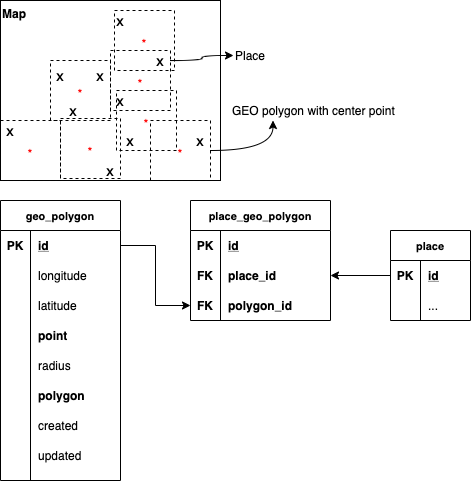

# 8. GEO-location persistence layer.

Date: 2020-10-19

## Status

In progress

## Context

### Design

GEO-location persistence layer built on the top of PostGIS plugin.
PostGIS allows store, query and index spatial data in SQL DB in a very effective manner.
Couple tables created in the DB to bind places with GEO polygons:

### Geo polygon repository methods

* `IsPointCovered` returns `true` if the point fully covered by one or more polygons, otherwise `false`.

* `GetPointCoveredPlaces` returns all places which are covered by a specific point polygon.

* `GetPolygonPlaces` returns all places which belong to the specific polygon.

* `AddPolygonPlace` bind place to the specific polygon (do nothing if binding exists).

* `AddPolygon` persists GEO polygon with center in a specific point.

* `GetPolygon` return GEO polygon entity with center in a specific point.

* `GetPolygonPlace` returns a specific place that belongs to the specific polygon.

### Known issues

1. `IsPointCovered` method affected by PostGIS precision issue, more information here: https://gis.stackexchange.com/questions/376706/postgis-st-covers-doesnt-match-polygon-after-st-union
2. Performance should be measured.
