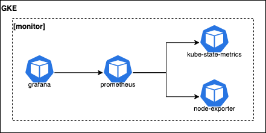

# 9. Monitoring solution.

Date: 2020-11-10

## Status

In progress

## Context

Current solution was made for system and business metrics monitoring.
Probably it will be extended in the future with logs collector and traces.

### Design

Recon monitoring was build on top of GCP GKE application:
https://github.com/GoogleCloudPlatform/click-to-deploy/blob/master/k8s/prometheus/README.md

The application contains all required components, but Grafana component should be upgraded with newer version.

Also, to save money `alert-manager` component should be disabled for `non-prod` environment:


### Prerequisites

* Service must expose `/metrics` REST API for Prometheus collector.

* Metadata section of K8S service configuration must be extended with below annotations:
```yaml
  annotations:
    prometheus.io/scrape: "true"
    prometheus.io/path: "/metrics"
    prometheus.io/port: "${PORT}"
```

* Setup required CLI tools: https://github.com/GoogleCloudPlatform/click-to-deploy/blob/master/k8s/prometheus/README.md#set-up-command-line-tools

### Setup instructions

* Connect to GKE cluster.

* Configure `gcloud` Docker credential helper: `gcloud auth configure-docker`

* Setup GKE with Application understanding resources: `kubectl apply -f "https://raw.githubusercontent.com/GoogleCloudPlatform/marketplace-k8s-app-tools/master/crd/app-crd.yaml"`

* Clone `click-to-deploy` repository: git clone --recursive https://github.com/GoogleCloudPlatform/click-to-deploy.git

* Change directory: `cd click-to-deploy/k8s/prometheus`

* Run below script to create GKE monitoring namespace, generate configurations and create service accounts:
```bash
#!/usr/bin/env bash
export APP_INSTANCE_NAME=monitoring
export NAMESPACE=monitor

TAG=2.11
export IMAGE_PROMETHEUS="marketplace.gcr.io/google/prometheus:${TAG}"
export IMAGE_ALERTMANAGER="marketplace.gcr.io/google/prometheus/alertmanager:${TAG}"
export IMAGE_KUBE_STATE_METRICS="marketplace.gcr.io/google/prometheus/kubestatemetrics:${TAG}"
export IMAGE_NODE_EXPORTER="marketplace.gcr.io/google/prometheus/nodeexporter:${TAG}"
export IMAGE_GRAFANA="docker.io/grafana/grafana:7.3.1-ubuntu"
export IMAGE_PROMETHEUS_INIT="marketplace.gcr.io/google/prometheus/debian9:${TAG}"

export GRAFANA_GENERATED_PASSWORD="$(pwgen 12 1 | tr -d '\n' | base64)"
export PROMETHEUS_REPLICAS=1
export STORAGE_CLASS="standard"

kubectl create namespace "$NAMESPACE"
kubectl create clusterrolebinding cluster-admin-binding \
   --clusterrole cluster-admin \
   --user $(gcloud config get-value account)

export PROMETHEUS_SERVICE_ACCOUNT="${APP_INSTANCE_NAME}-prometheus"
export KUBE_STATE_METRICS_SERVICE_ACCOUNT="${APP_INSTANCE_NAME}-kube-state-metrics"
export ALERTMANAGER_SERVICE_ACCOUNT="${APP_INSTANCE_NAME}-alertmanager"
export GRAFANA_SERVICE_ACCOUNT="${APP_INSTANCE_NAME}-grafana"
export NODE_EXPORTER_SERVICE_ACCOUNT="${APP_INSTANCE_NAME}-node-exporter"

cat resources/service-accounts.yaml \
  | envsubst '$NAMESPACE $PROMETHEUS_SERVICE_ACCOUNT $KUBE_STATE_METRICS_SERVICE_ACCOUNT $ALERTMANAGER_SERVICE_ACCOUNT $GRAFANA_SERVICE_ACCOUNT $NODE_EXPORTER_SERVICE_ACCOUNT' \
  > "${APP_INSTANCE_NAME}_sa_manifest.yaml"

kubectl apply -f "${APP_INSTANCE_NAME}_sa_manifest.yaml" --namespace "${NAMESPACE}"

awk 'FNR==1 {print "---"}{print}' manifest/* \
  | envsubst '$APP_INSTANCE_NAME $NAMESPACE $STORAGE_CLASS $IMAGE_PROMETHEUS $IMAGE_ALERTMANAGER $IMAGE_KUBE_STATE_METRICS $IMAGE_NODE_EXPORTER $IMAGE_GRAFANA $IMAGE_PROMETHEUS_INIT $NAMESPACE $GRAFANA_GENERATED_PASSWORD $PROMETHEUS_REPLICAS $PROMETHEUS_REPLICAS $PROMETHEUS_SERVICE_ACCOUNT $KUBE_STATE_METRICS_SERVICE_ACCOUNT $ALERTMANAGER_SERVICE_ACCOUNT $GRAFANA_SERVICE_ACCOUNT $NODE_EXPORTER_SERVICE_ACCOUNT' \
  > "${APP_INSTANCE_NAME}_manifest.yaml"
```

* Edit `${APP_INSTANCE_NAME}_manifest.yaml` if you want to disable or customize deployment.

* Run below script to create GKE monitoring Application:
```bash
#!/usr/bin/env bash
export APP_INSTANCE_NAME=monitoring
export NAMESPACE=monitor

kubectl apply -f "${APP_INSTANCE_NAME}_manifest.yaml" --namespace "${NAMESPACE}"
```

* Follow instruction to access Grafana UI: https://github.com/GoogleCloudPlatform/click-to-deploy/blob/master/k8s/prometheus/README.md#access-the-grafana-ui
