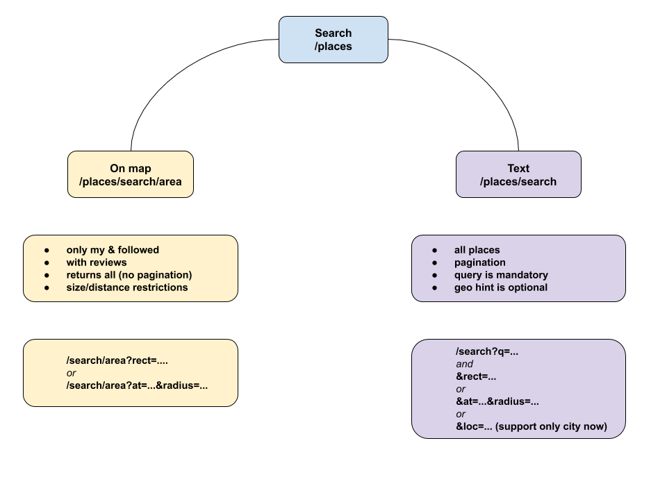
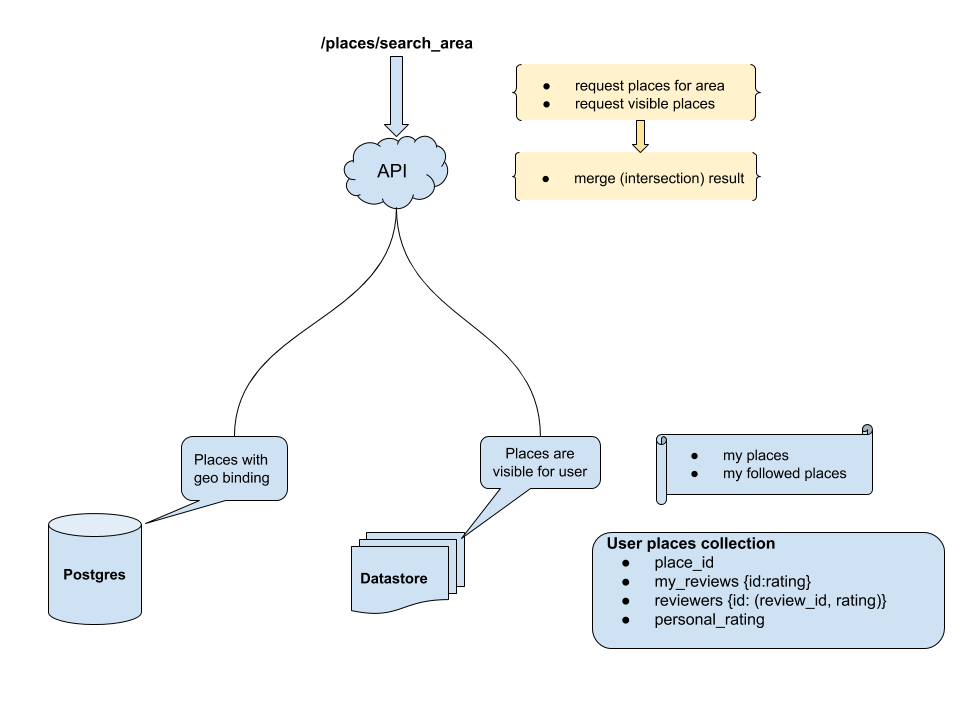
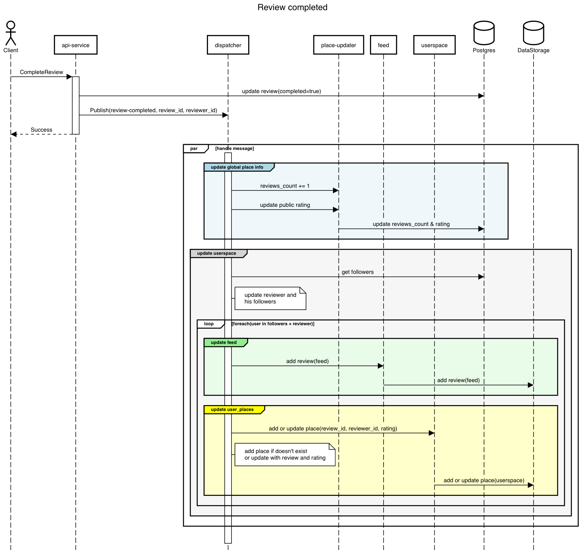
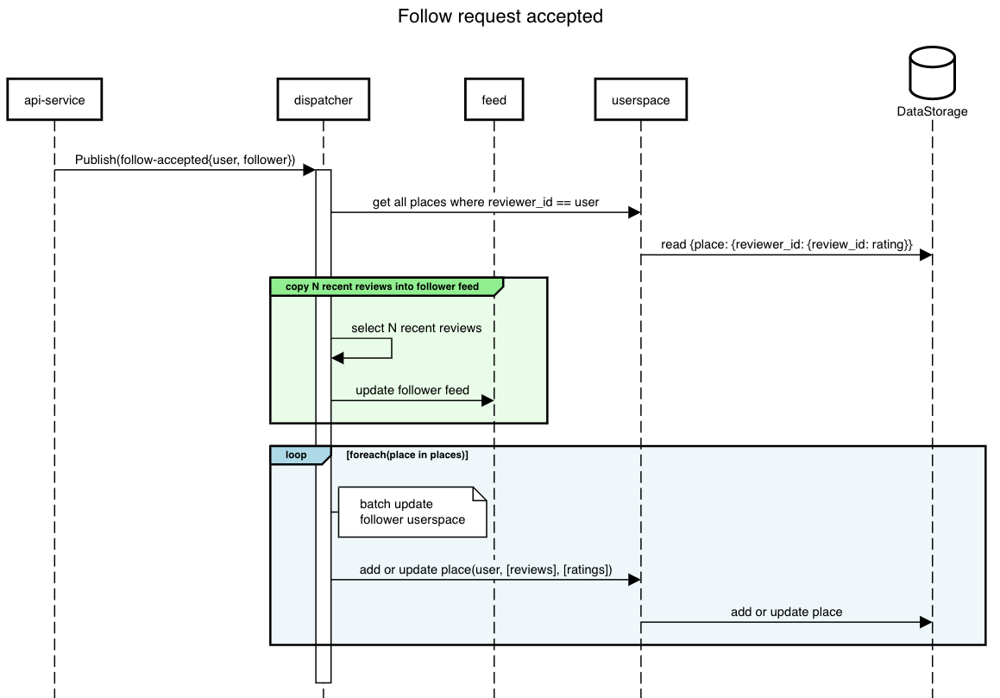

# 12. userspaces

Date: 2020-12-04

## Status

In progress

## Context

We need a fast way to provide user-specific places, reviews, and ratings. It means the user sees only places rated by users that he follows, with the ratings calculated separated for each user.
```
User1 follows User2, User3, User4
User2 follows User3
User3 and User4 don't follow anybody

User2 reviewed Place1 -> rating 6 and Place2 -> rating 2
User3 reviewed Place1 -> rating 2
User4 reviewed Place1 -> rating 10, Place2 -> rating 10

User1 sees: [Place1: 6, Place2: 6]
User2: [Place1: 4, Place2: 2]
User3: [Place1: 2]
User3: [Place1: 10, Place2: 10]
```

So, each user has a specific set of places.

## Decision

The solution is to create a `userspace` for each user. Userspace is the set of collections in the NoSQL describes places, reviews, feed, etc that visible for the user.

Userspace is updated eventually on events happening in the system (new review, follow accepted, etc).

### The search types

Recon API provides two different search types.
* geo search (search on map) - the POIs list is created based on userspace;
* text search - search for global POIs database (no userspaces).



### The approach architecture

When user searches POIs on the map, the service executes two parallel queries: 
* search for POI based on geographical criteria (rect, nearby)
* get all visible places

and after
* finds intersection for two sets
* hydrates POI with personal ratings



### Userspace update scenarios

#### New review created

When the user completes the new review, the service:
* updates the global place rating
* updates user feed with the new review
* updates feed for all followers
* updates user places
* updates user places for all followers



#### Follow request accepted

When the follow request accepted:
* copies N recent reviews into the new follower feed
* updates the follower user places with all places from followed user



## Consequences

* We lost the strong consistency, different users will see changes eventually
* Concerns about influencers (users with tons of reviews and followers), perhaps we need different processing for them
