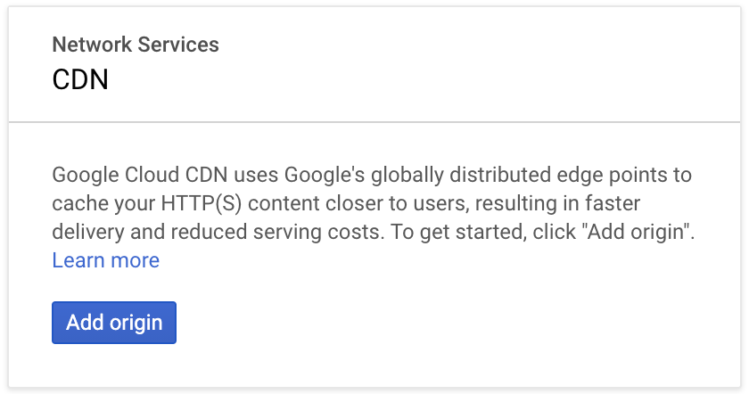
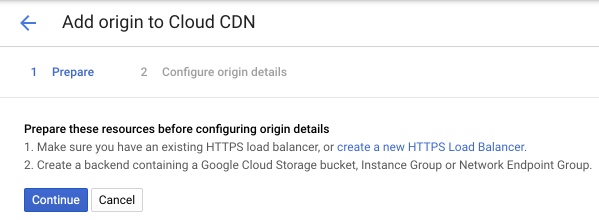
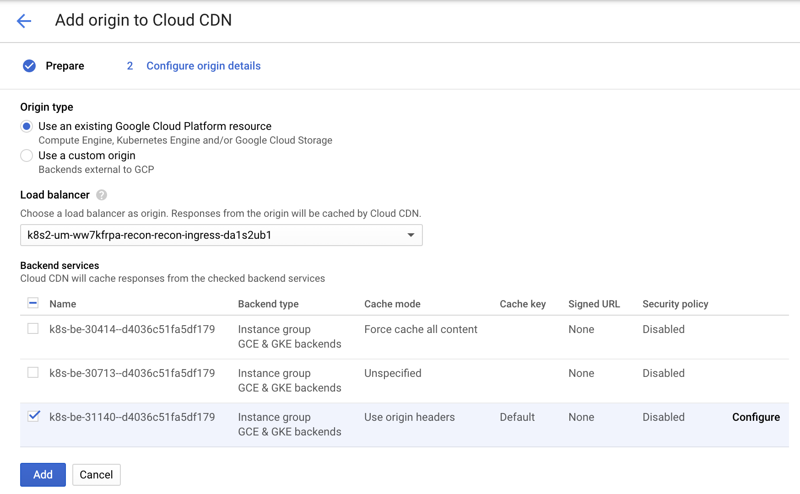
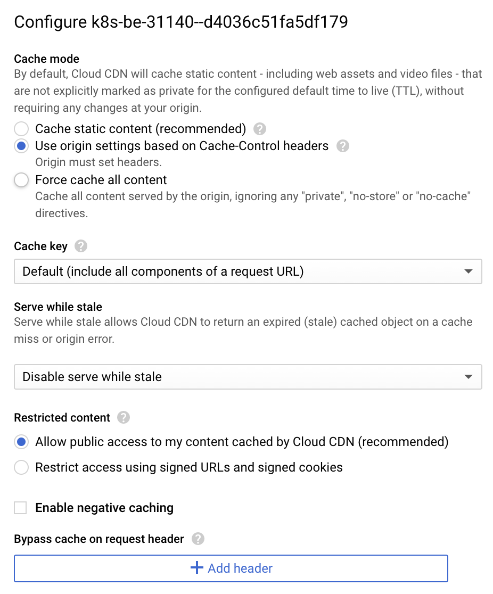

# 13. GCP CDN cache configuration.

Date: 2021-01-25

## Status

In progress

## Context

CDN will be used as cache layer for Preview service generated shared previews in HTML format.
So, users will be able to download previews without hitting Recon API and with small latency from network perspective.

## CDN cache configuration

* Open GCP CDN page: `https://console.cloud.google.com/net-services/cdn/list`

* Click `Add origin`: 

* Click `Continue`: 

* Choose appropriate backend service and click `Configure`: 

* Select `Use origin settings based on Cache-Control headers` and click `Save`: 

### CDN cache invalidation

