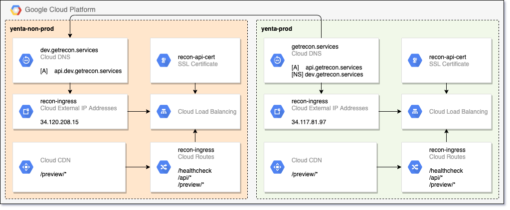

# 14. DNS + SSL + Static IP + Ingress + CDN configuration guide.

Date: 2021-01-26

## Status

In progress

## Context

Recon external API exposing setup guide.

## High level scheme

## Configuration steps for `prod` environment

* Create new public DNS zone (with `DNSSEC` enabled)

* Register new public domain name (`getrecon.services`)

* Create GCP Static API (`recon-ingress` -> `34.117.81.97`)

* Create DNS A record (`api.getrecon.services` -> `34.117.81.97`)

* Deploy K8S `ManagedCertificate` for `api.getrecon.services`

* Deploy K8S Ingress

* Create CDN cache for Preview service (refer to `https://github.com/yenta20/doc/blob/master/decisions/backend/0013-preview-cdn-cache.md`)

## Configuration steps for `non-prod` environment

* Create new public DNS zone (with `DNSSEC` enabled)

* Create GCP Static API (`recon-ingress` -> `34.120.208.15`)

* Create DNS A record (`api.dev.getrecon.services` -> `34.120.208.15`)

* Create NS record in `prod` GCP project DNS zone with name servers from `non-prod` GCP project DNS zone

* Deploy K8S `ManagedCertificate` for `api.dev.getrecon.services`

* Deploy K8S Ingress

* Create CDN cache for Preview service (refer to `https://github.com/yenta20/doc/blob/master/decisions/backend/0013-preview-cdn-cache.md`)
