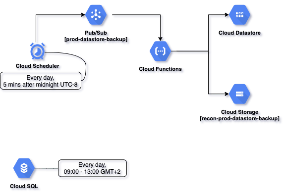

# 15. Backup solution.

Date: 2021-02-22

## Status

In progress

## Context

Recon data backup solution.

## Backup scheme

## Cloud SQL backup

SQL DB backup configured for Production environment via GCP console:
https://console.cloud.google.com/sql/instances/recon-prod/backups?project=yenta-prod

Backups window: `9:00 AM — 1:00 PM (UTC+2)` 

## Datastore backup

Backup configuration guide:
https://cloud.google.com/datastore/docs/schedule-export#export-all-entities

Backups frequency: `Every day, five minutes after midnight (UTC-8 Los Angeles)`
Backup location: GCP bucket
